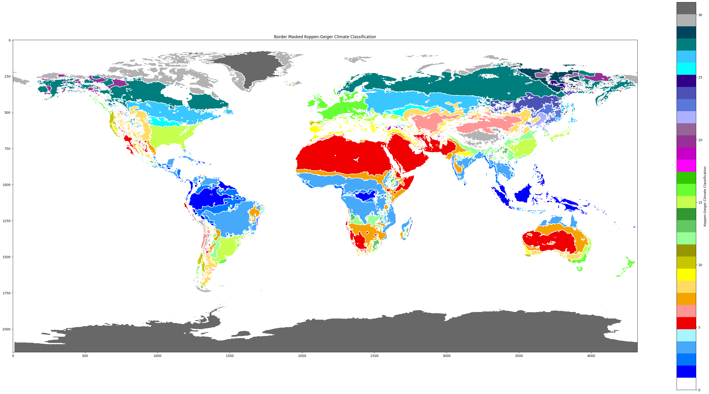

# Climate Classification

- [Climate Classification](#climate-classification)
- [IMPORTANT NOTICE](#important-notice)
  - [Introduction](#introduction)
  - [The Classifications Methods](#the-classifications-methods)
    - [Koppen-Geiger Climate Classification](#koppen-geiger-climate-classification)
    - [The Naive Bayes Classifier](#the-naive-bayes-classifier)
  - [The Data](#the-data)
  - [License](#license)
  - [Contributing](#contributing)

# IMPORTANT NOTICE

The project is currently in a very early stage of development. The code is not yet ready for use. The README is also not yet complete.
Contributions are welcome, but please read the [CONTRIBUTING.md](CONTRIBUTING.md) file before submitting a pull request.

**It is not working at the moment**

## Introduction

This project aims to predict the likelihood of an observed variable being in a certain category (biome) based on the values of the observed variables.

We aim to classify the biome of a given location based on the following observed variables:

- Bioclimactic Variables
- Temperature
- Precipitation

And in future we hope to include the following observed variables:

- Elevation
- Soil Type
- Vegetation Type
- Animal Type

More info about the data can be found [here](#the-data).

## The Classifications Methods

Predicting the biome of a given location based on the observed variables is a classification problem. There are many classification methods available, but we will focus on the following:

- Koppen-Geiger Climate Classification
- Naive Bayes Classifier

### Koppen-Geiger Climate Classification

The Koppen-Geiger climate classification is designed specifically for climate classification. It divides the climate into 5 main categories, which are then further divided into subcategories. The main categories are as follows:

- A: Tropical
- B: Dry
- C: Temperate
- D: Continental
- E: Polar

More information on the Koppen-Geiger climate classification can be found [here](https://en.wikipedia.org/wiki/K%C3%B6ppen_climate_classification).

A heavily modified version of [salvah22](https://github.com/salvah22/koppenclassification)'s python implementation is used.

The Koppen-Geiger classification will then be applied to the data to create a training set for the Naive Bayes classifier.

### The Naive Bayes Classifier

The Naive Bayes classifier is a probabilistic classifier that uses Bayes' theorem to calculate the probability of a certain observation being in a certain category based on the assumption that the observed variables are independent of each other.

More information on the Naive Bayes classifier can be found [here](https://en.wikipedia.org/wiki/Naive_Bayes_classifier).

Bayes' theorem is as follows:
$$P(A|B) = \frac{P(B|A)P(A)}{P(B)}$$

In the context of the project we can assume the following:

- The observed variables are independent of each other
- The observed variables are normally distributed
- The observed variables are continuous
- The categories are equiprobable
  
The probability that a given observation is in a certain category is calculated as follows:

- $B$ is the category (Biome) we aim to predict
- $B_i$ is the $i$th category (Biome)
- $X$ is the vector of observed variables (Temperature, Precipitation, Elevation)

$$p(X \in B | X = x) = \frac{p(X = x | X \in B) p(X \in B)}{\sum_{i=1}^{n} [p(X = x | X \in B_i) p(X \in B_i)]}$$

Because we assume that the categories are equiprobable, $X$ has a uniform distribution over the categories. Thus $P(X \in B) = \frac{1}{n}$

$$p(X \in B | X = x) = \frac{p(X = x | X \in B) \frac{1}{n}}{\sum_{i=1}^{n} [p(X = x | X \in B_i) \frac{1}{n}]}$$

$$p(X \in B | X = x) = \frac{p(X = x | X \in B)}{\sum_{i=1}^{n} [p(X = x | X \in B_i)]}$$

In words, we can say that the postulate probability that our class is $B$ for the observation $x$ is the probability of $x$ occurring in $B$ divided by the sum of $x$ occurring in all other categories.

The probability of $B$ occurring is then given by $P(B) \div \sum postulates$, but this is not a necessary step as we can simply take the max postulate. Bare in mind that this does not account for outliers. (TODO VERIFY)

## The Data

The data used in this project is from the [WorldClim](https://www.worldclim.org/) database. The data is available for download [here](https://www.worldclim.org/data/worldclim21.html).

The 5 minute resolution data is used for this project.

The downloader script will download and extract the `.tif` files for the following variables by default:

- Bioclimactic Variables
- Average Temperature
- Precipitation

The data is averaged over the years 1970-2000 to create a single `.tif` file for each variable.

## License

This project is licensed under the MIT License - see the [LICENSE](LICENSE) file for details

## Contributing

Please read [CONTRIBUTING.md](CONTRIBUTING.md) for details on the code of conduct, and the process for submitting pull requests.